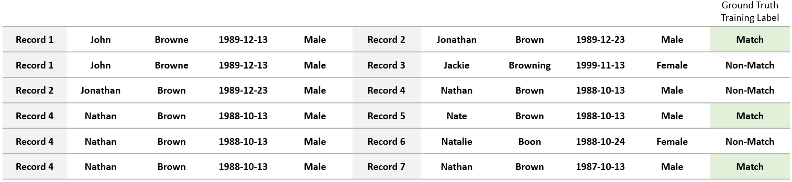
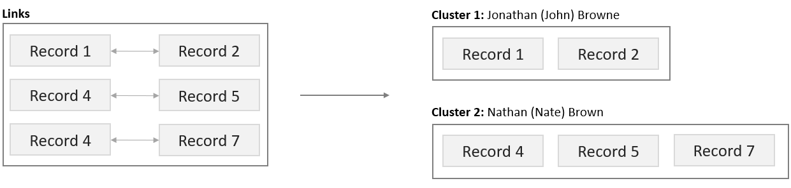
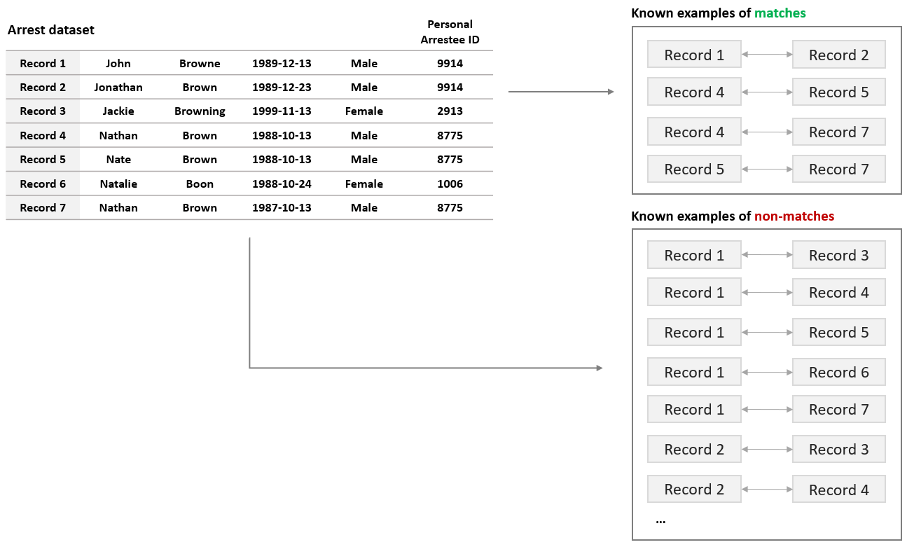

About Name Match
================

Name Match is a tool for probabilistically linking the records of individual entities (e.g. people) within and across datasets.

The code is optimized for linking people in criminal justice datasets (arrests, victimizations, city programs, etc.) using at least first name, last name, date of birth, and age (some missingness in DOB and age is tolerated). If available, other data fields (like middle initial, race, gender, address, and zipcode) can be included to strengthen the quality of the match.

What is Name Match doing?
#########################

The goal of Name Match is to add a universal person identifier column to the input dataset(s) so that it is possible to easily identify all records that refer to the same person. To do this, it uses training data to learn a model about what record pairs look like when they refer to the same person (or "match) vs. when they don't refer to the same person. This model is then used to predict the likelihood that two records match. Once we know which pairs of records match, we can assign each record a unique person identifier that links it to all of its matches. 

Because Name Match's primary output is a person identifier assigned to all input records, Name Match can be thought of as both a record *linkage* tool and a *deduplication* tool. That is, once each input dataset has a universal person identifier column, the datasets can be linked and/or collapsed to one row per person (deduplicated).

**How are records compared to each other?** Each record contains fields that help identify a person, such as name, date of birth, and gender. When two records are compared, we generate a series of similarity metrics by comparing each field from one record to the corresponding field in another record. Exactly what similarity metric is used to compare two fields depends on the type of information in the field (i.e. string, date, categorical variable). Edit distance between first name fields, number of days between dob fields, and whether or not the gender fields exactly match are all examples of similarity metrics that might be generated. 

.. image:: images/comparing_records.png
    :alt: comparing records

**How does the model learn to distinguish matching records from non-matching records?** The prediction model built by Name Match is a *[supervised](https://en.wikipedia.org/wiki/Supervised_learning)* learning model, meaning the learning process requires labeled training data, or a set of record pairs with ground-truth "match" or "non-match" labels. See the :ref:`requirements-for-using-name-match` section below for more information about where this labeled training data comes from and to determine if your input data meets the requirements. Once the model is learned, it is used to predict which record pairs are matches and which are not.

**How does Name Match go from a list of predicted matches to a person identifier?** Matching pairs, or *links*, are chained together to form *clusters*, which are groups of records that all refer to the same person. For example, if records A and B match and records B and C match, then records A, B, and C all refer to the same person and form a cluster. Each cluster is assigned a unique id, which becomes the universal person identifier assigned to each record in the cluster. Using your domain knoweldge or experties on a particular dataset, you can even create custom functions to discard predicted links that violate any constraints you define. For example, you could disallow links between two records from the same dataset or disallow clusters with more than three unique DOB values.

.. _requirements-for-using-name-match:

Requirements for using Name Match
#################################

In order to use Name Match to deduplicate or link data, **a portion of the input data must meet the following criteria**:

1. Already have a unique person or entity identifier that can be used to link records (e.g. Social Security Number or Fingerprint ID)
2. Be granular enough that some people or entities appear multiple times (e.g. the same person being arrested two or three times)
3. Contain inconsistencies in identifying fields like name and date of birth (e.g. a person is arrested once as John Browne and once as Jonathan Brown)

**Why do these requirement exist?** As mentioned above, Name Match requires training data in order to learn what distinguishes matching records (those that refer to the same person) from non-matching records. The portion of input data that meets the above requirements is *where this training data comes from!* To understand why this is the case, we turn to an example from the crimnal justice context. 

Say you are linking two datasets: a dataset of arrest records and a dataset of individauls that recently participated in a city program. The arrest data exhibits the three required characteristics above due to the fact that a person can be arrested more than once and each time they are linked via fingerprint to the same Personal Arrestee ID despite typos and nicknames causing discrepancies in personal information. If someone with Personal Arrestee ID 9914 is arrested twice, those two records are known to be a match. If someone else with Personal Arrestee ID 2913 is arrested, we know that that record is NOT a match with either of the records with Personal Arrestee ID 9914. With just three records, we are well on our way to the ground truth training data Name Match needs!

Another requirement for record linkage, not specific to Name Match, is having common identifying information across the files that are being linked. First name, last name, dob, and are are required fields, but additional information like middle initial, race, gender, and address can improve the quality of the match. In order for these extra fields to be helpful, however, they have to be present in all input datasets. If one dataset has name, dob, age, and address and the other dataset has name, dob, age, and gender, only name, dob, and age can be used by the matching algorithm.  

Inputs and outputs
##################

**Inputs:**

* One or more CSV files
* Configuration information specifying which data fields to use, where to find them, how to compare them, etc. (yaml file or python dictionary)
* (Optional) User-defined constraints, or specific rules about what would make a particular link or cluster invalid (python functions)

**Outputs:**

A copy of the CSV files that were input into Name Match, now with an additional unique person identifier column (cluster id). This id is a unique identifier that links records  within and between files.

See :ref:`setting-up-a-match` for specific information about preparing the inputs.
