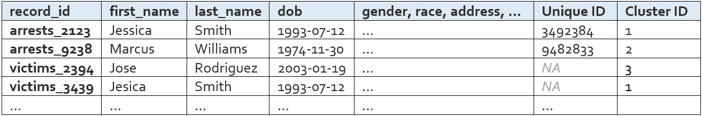

.. _detailed-algorithm-documentation:

Detailed Algorithm Documentation
================================

.. role:: raw-html(raw)
    :format: html

Why is Name Match necessary
###########################

A common task when working with administrative datasets is the need to identify which records belong to which people. In the best case, this is a non-problem because the administrative data already includes a unique identifier for individuals. However, in many instances a unique identifier does not exist for all records, or is not shared across the different datasets that need to be linked. 

Name Match is a probabilistic record linkage algorithm developed to address a specific form of this problem: when a unique identifier exists for some but not all records that need to be linked. By leveraging a supervised learning approach, Name Match is able to identify links – pairs of records that refer to the same person – both across  and within datasets. These links can then be chained together to represent individual people and all of their associated records. 

Conceptual background
*********************

Record linkage tasks can be characterized more generally as clustering problems, which is helpful for conceptualizing the goal of Name Match. There is a set of records that need to be grouped, or clustered, into people. The more similar two records are, the closer they are to each other or the stronger the link between them, and the more likely they are to get clustered into the same group. Conceptually, there is a similarity score [#f1]_ between each pair of records, and the goal of Name Match is to estimate these similarity scores to inform which records end up in the same group. 

For certain types of record pairs, the similarity score does not need to be estimated – it is known. The first type of known record pair is called a Must-Link and has a known similarity score of 1. The second type of known record pair is called a Can’t-Link, with a known similarity score of 0. The knowledge needed to identify these special types of links comes from two sources: 1) the subset of records that already have a unique identifier pre-Name Match or 2) task-specific rules about what types of links are allowed. If two records have the same unique identifier when input to Name Match, they are a Must-Link pair. Conversely, if two records have different unique identifiers, they are a Can’t-Link pair. If the user indicates that dataset C only has one record per person, then record 1 and record 2 from dataset C form a Can’t-Link pair. If a student must attend elementary school before they can attend high school, then all pairs where elementary enrollment date is later than high school enrollment date are Can’t-Link pairs.

The vast majority of record pairs, however, begin with unknown similarity scores. Name Match estimates these values to fill in the complete picture of how each record relates to each other record. Once every record pair has a similarity score, the algorithm can determine where to draw the boundaries between records to form record groups, or people. 

How it works
############

While the dataset(s) output by the Name Match algorithm look very similar to the input dataset(s) – the only difference is a new unique person identifier – there is a lot happening under the hood during the matching process. Data is combined, filtered, merged, modeled, and otherwise transformed, all in an effort to create this new unique person identifier and measure its accuracy. The goal of this section is to walk through the algorithm step-by-step, providing a common terminology and conceptual understanding of Name Match for both users and developers. The next section discusses the important things to consider when evaluating match quality. 

There are five steps in the algorithm: setup, blocking, measuring differences, modeling, and clustering. As shown in the diagram below, each step produces one or two outputs that are critical for the match. 

**Name Match Process Map**
:raw-html:` `
*Note: the squares with dark borders represent tabular data outputs (e.g. csv files)*

.. image:: images/flowchart.png
    :alt: data flow diagram

:raw-html:` `

Name Match inputs and outputs
*****************************

The inputs to Name Match are: 

.. rst-class:: spaced-list

    1.  **Some number of data files to be deduped and linked.** A set of CSV files with information about people, such as first name, last name, dob, gender, address, etc.

    2.  **The config file.** A yaml file with important configuration information about how to perform the match – what data and fields to use, customizable settings, etc.

    3.  **(Optional)** A constraints file. A python file defining the types of links that should be prohibited, both at the pair level and the “cluster” (i.e. person) level. 

The output is simply the data files you started with – now with a unique person id column – and a log file showing various performance statistics. 

Requirements for using Name Match
*********************************

Name Match is a supervised algorithm, meaning it requires known examples of matching and non-matching record pairs to learn from. To get these known examples, at least one of the datasets (or part of one of the datasets) being included in the match must meet three requirements. 

* People can show up multiple times
* There is an existing unique identifier that tracks people across their records
* Some people have variation in their identifying information across records, such as typos, nicknames, new or hyphenated last names, etc. 

These requirements are typically met by arrest or incarceration data, since they are recorded at the incident level (a person can show up multiple times) and a little messy in all fields except fingerprint ID or SSN (existing unique id + variation in name/dob/etc.). However, it’s possible that other types of datasets will meet these criteria as well. See the :ref:`when-to-be-wary` section below for more information about when using Name Match might not be appropriate. 

Another requirement for matching, not specific to Name Match, is having common identifying information across the files that are being linked. First name, last name, and dob are required fields, but additional information like middle initial, race, gender, and address can improve the quality of the match. In order for these extra fields to be helpful, however, they have to be present in all input datasets. If one dataset has name, dob, and address and the other dataset has name, dob, and gender, then only name and dob can be used by the matching algorithm.  

Step 1: Setup 
*************

First the input data is read in and organized into the set of records that will be matched. Name Match knows how to organize the data because of the instructions the user provides in the config file. The config file directs the code to know 1) what input data to read in, 2) which columns are going to be helpful for linking, 3) what records to exclude from the match, and 4) what settings and parameters to use for the match. There is only one tangible output of the setup step: the all names file. 

**All Names File**

The all names file is basically just the person-specific information from all of your input data, stacked into one table. The rows in this table are all of the records that will be matched/deduped during Name Match. 

.. image:: images/all_names_table.png
    :alt: all names file

The columns that appear in this table are the “variables” the user defines in the config file. These variables are what will be used to link records.

There are a few columns that are added automatically – record_id, dataset, file_type, blockstring, tmp_raw_first_name, tmp_raw_last_name, and drop_from_nm – but these can be ignored by the average user. 

Step 2: Blocking
****************

Name Match does not compare every record to every other record, because it would take too long and many of the comparisons would be a waste of time (e.g. a record with name Melissa McNeill is very unlikely to be a match to a record with name Zubin Jelveh). The goal of the blocking step is to identify record pairs that are similar enough to warrant a closer look. Name Match employs a two step blocking approach. 

.. rst-class:: spaced-list

    * First, identify full-name pairs that are reasonably similar to each other (e.g. Melissa McNeill and Melinda McNeal). Name similarity is measured using cosine distance, and the definition of reasonable varies depending on how common the name is and what dob information is available. By default, these threshold values range between between 0.15 and 0.4; these values were found to yield good blocking performance across several large-scale data linking tasks we've completed using Name Match.

    * Second, expand this list of full-name pairs to the set of full-name/dob pairs we observe in the data and drop pairs where the dobs have more than X differences. By default, this threshold varies between 0 and 2 based on how similar the first and last names are (again based on use in prior linkage tasks). For example, the (Melissa McNeill 1993-04-12, Melinda McNeal 1993-04-11) pair would likely make it through the blocking step, but the (Melissa McNeill 1993-04-12, Melinda McNeal 1954-04-11) pair would not. 

The final output of the blocking step is the candidate pairs list, which is the list of full-name/dob pairs that pass these two “similar enough” filters. An important intermediate output of the blocking step is the NMSLIB index. Both of these outputs are described below.

**NMSLIB Index**

The NMSLIB index is used during the first part of blocking – the part that identifies full-name pairs that are reasonably similar to each other. `NMSLIB <https://github.com/nmslib/nmslib>`_ is an open source python package that creates vector spaces, or indices, that can be queried for approximate near neighbor search. In our context, we build the index using all unique first and last names in our data and then for each name, ask the index to return the ~400 most similar names. As mentioned above, name similarity is measured via the cosine distance of 2-letter shingles. For example, the index encodes the name JOHN SMITH as the vector ``[^J, JO, OH, HN, N$, ^S, SM, MI, IT, TH, H$]`` and compares it to other name vectors to find similar names such as JON SMITH and JOHN SMITHE. By default, we upweight the importance of shingles in the last name (via the ``alpha`` parameters). Using an approximation index like NMSLIB saves us from having to compute the cosine distance between every single pair of names in the dataset, which would be computationally expensive and prohibitively slow. 

.. _take me to blockstrings:

**Candidate Pairs List**

The candidate pairs list is the list of name/dob pairs (called **blockstrings**) that are similar enough to warrant a full comparison. It contains the pairs that made it past both the name similarity filter and the dob similarity filter. It looks like this: 

.. image:: images/candidate_pairs_list.png
    :width: 75%
    :alt: candidate pairs list

This list is very important, as it contains all of the pairs that will continue on in the matching process. All name pairs that are not in this list will not be considered past the blocking step, meaning there is no way for those pairs to later become a match. 

All of the name/dob pairs that we *know* are matches because of ground truth data like SSN or fingerprint ID are automatically included in the candidate pairs list. If we trust our ground truth labels and therefore know certain pairs refer to the same person, this forces them to get past the blocking step and continue on in the matching process. 

Step 3: Measuring differences
*****************************

Now that we have identified name/dob pairs that have passed the blocking step (i.e. are similar enough to warrant a full comparison), we need to build the dataset that will allow for that full comparison. Each row in that dataset will be associated with a record pair and the columns will contain information on the similarity between identifying fields (name, dob, address, race, gender, etc.) across the pairs of records. We refer to this dataset as the “data rows” file, and it is the main output of this step in the algorithm. One important intermediate output, however, is the name probability object. Both outputs are described below.  

**Name Probability Object**

This object is used to obtain information about the uniqueness of a name, as well as the likelihood that two names refer to the same person. Name Match relies on the solution implemented `here <https://github.com/zjelveh/name-probability>`_. 

**Data Rows**

We take the candidate pairs dataframe and merge on the all names dataframe (twice – first on the name and dob from records 1 and then on the name and dob from record 2). Now we have a table that is at the record pair level and is basically two all-names rows side by side. We use this table to compute distance metrics and produce the data rows table, which looks like this: 

.. image:: images/data_rows_table.png
    :alt: data rows table

.. _compare-type-to-metric-mapping:

The exact distance measures that are calculated for a given input field are determined by the type of the input data field. The first name field, for example, is a string and would naturally require a different set of distance measures than something like gender, which is a categorical. The measures calculated for each input field type are detailed below. 

For string fields (e.g. first name, last name, address street name, zipcode):

* Character distance measures

  * Edit distance 
  * Jarowinkler distance
  * Exact match flag
  * Exact match on first letter flag
  * Exact match on first three letters flag
* “Sounds like” measures
  * Soundex
  * NYSIIS
* Missingness flag

For date fields (e.g. dob, incident date):

* Edit distance
* Exact match flag
* Day difference 
* Missingness flag

For categorical fields (e.g. sex, race, address type): 

* Exact match flag
* Component exact match flag (e.g. BLACK and BLACK HISPANIC == 1)
* Missingness flag

For numeric fields: 

* Numeric difference

For geographic fields (e.g. lat/lon):

* Physical distance between two points
* Missingness flag

For UniqueID fields (e.g. SSN, fingerprint):

* Exact match flag – this generates the very important column called “label”

For first and last name (in addition to the string distance metrics mentioned above): 

* Probability of name 1 (using the name probability object)
* Probability of name 2
* Probability that the two names refer to the same person
* Commonness of name 1 (relative frequency of this name in the input datasets)
* Commonness of name 2

Step 4: Modeling
****************

With this dataset of detailed features describing the candidate record pairs in hand, it’s time to build the probability model and predict which pairs are a match. 
 
The data rows table houses both the “known examples” needed to teach the model what matches look like and the “unknown examples” that require predictions. The “label” column is the outcome variable – it is simply a binary variable indicating whether or not the two records have the same Unique ID (e.g. fingerprint ID, SSN). The subset of rows with values in the “label” column will be the split into a training set and a labeled evaluation set, for estimating out-of-sample model performance. The rows with NA labels will get predictions.

**Random Forest Model**

The random forest model uses the labeled data to learn the characteristics of matching record pairs and non-matching record pairs, and then generate a match probability for all of the unlabeled pairs. Like any random forest model, we can look to see which features are most `"important" <https://explained.ai/rf-importance/>`_ for the model. Name and dob-related features are almost always at the top of the list, followed by name commonness, address, middle initial, and finally categoricals like gender and race. 

**Potential Links List**

The potential links list is simply the subset of data rows that either have a label of 1 or a predicted label greater than the threshold used to determine if a record pair is a predicted match. These are the pairs of records that we believe to be the same person. A shorter and slimmer version of the data rows table, it looks like this: 

.. image:: images/potential_links_table.png
    :width: 350
    :alt: potential links table

The probability threshold is chosen to optimize the F Score, which is a weighting of false positives and false negatives. By default, this computation is weighted such that false positives are twice as costly as false negatives (i.e. the F :subscript:`0.5` Score). The ideal cost ratio will depend on the matching use case; however, one reason why you might want to take special care to prevent false positive links is that matches that don’t pass the link threshold during modeling stage can always be recovered via other links during clustering (Step 5). To change the weighting used from the default of 0.5, you can specify `fscore_beta` in the config (e.g. `fscore_beta : 0.75`).

Step 5: Clustering
******************

The record pairs in the potential links list enter the clustering phase, which forms links between records unless the link causes a constraint violation (e.g. an arrest record comes at a later date than a homicide victimization, or a cluster forms with multiple unique fingerprint IDs). Clusters are groups of records that all belong to the same person.

The clustering process [#f2]_ is as follows: 

.. rst-class:: spaced-list

    #. Start with all of the records that are being matched – with no links between records.

    #. Add links between records that we know are the same person because of ground truth data like fingerprint ID or SSN.

    #. Sort the remaining potential links in descending order of predicted probability of a match.

    #. For each potential link: Check whether that link is valid and whether the cluster that would result from that link would be valid. If both the link and the cluster are valid, the potential link becomes an link. Validity is determined by a combination of settings defined in the configuration file and the logic defined in the optional constraints file.

    #. Identify the graph’s connected components and assign each one a number 1 to N. This “cluster id” is the unique person identifier Name Match was used to create.

**Cluster Dictionary**

After completing the clustering process described above, we’re left with the cluster dictionary. This object is simply a dictionary mapping record identifiers to person identifiers (i.e. ``record_id`` to ``cluster_id``). 

**“<Input File> with Cluster ID” Files**

As the name implies, these tables are identical to the input files, plus one additional column called “Cluster ID” that uniquely identifies a person across records both within and across input datasets. 

Following the same convention, an “All Names with Cluster ID” file is also created for convenience. It looks like this: 

:raw-html:` `

Things to consider
##################

These five steps show end-to-end how records and record pairs move through the Name Match algorithm in order to produce a unique person identifier, or cluster id. To summarize, a record pair will become a match if that record pair passes three filters: 

.. rst-class:: spaced-list

    #. **Blocking.** Are the names and dobs similar enough to take a closer look?

    #. **Modeling.** After this closer look, does the random forest generate a predicted probability above a certain threshold?

    #. **Cluster constraints.** Does this link pass all checks for logical constraint violations?

When looking through the output of a match, it can be helpful to think about these three filtering steps – all of the matches you observe made it past all three, and all of the non-matches you observe failed at least one. The statistics provided in a Name Match run’s matching report can help the user understand the impact and accuracy of each filter, which is important for identifying and fixing problems with the match.

Evaluating performance and identifying issues
*********************************************

Name Match outputs a matching report (HTML file) with key performance metrics and information about the number of records linked and clusters formed. These performance metrics are described below, along with several other terms that may be useful when evaluating performance and investigating results. 

How do we know if too many record pairs are getting filtered out via blocking?

The ratio share of ground truth matches that make it past the blocking step is known as the pair completeness. Specifically, 

.. image:: images/pc_equation.png
    :width: 60%
    :align: center
    :alt: pair completeness equation

:raw-html:` `

Blockstring pairs are pairs of First-Name, Last-Name, and DOB. These pairs are considered “True” if they are ever observed to belong to the same person, using the existing Unique ID variable. These pairs are considered “Covered” if they make it past both blocking filters and move on to the Measuring distances and Modeling steps.

Ideally this would be 100%, since the blocking filter is only intended to weed out the obvious non-matches. Some ground truth matches, however, may have names or dobs that are nothing alike – either because the existing UniqueID (e.g. SSN) being used to create ground truth has a typo or because the person got an entirely new last name. These pairs will not make it past the blocking step, and that’s okay. This means that, in practice, we have seen pair completeness measures around 90%-95% in the data that we have worked with (though we can't make any guarantees about your data). 

Another more manual way to make sure that your blocking step is working as intended is to take a peek at the candidate pairs list. This should be a long list of name/dob pairs where the names are reasonably similar and the dobs are within 2-character edits of each other. You can also look at what’s called the “uncovered” pairs list. These are the ground truth matches that don’t make it past blocking. The pairs in this list should not be that similar to each other, either according to name or dob.

**How do we know if the model is learning valuable information about matches and non-matches?**

There are several ways to diagnose if the model is performing well, some that are specific to Name Match and others that are identical to how you’d evaluate the performance of any predictive model. 

Predictive models should be evaluated out-of-sample (i.e. on data that was not used to train the model) using metrics like precision, recall, false positive rate, false negative rate, etc. – and Name Match is no different. In our experience when linking with name and full date-of-birth information, the values for precision and recall are typically very high (~.99). False positive rates and false negative rates are in the < 5% range.

Reasons why the model might be underperforming according to these metrics include: 1) not enough training data, 2) a large number of known examples, but few examples of known non-matches [#f3]_, or 3) not enough variation between known matches and known non-matches in your training data. You can look at the training data by loading the data rows and filtering to rows where “label” is not missing -- it will be either 1 (match) or 0 (non-match).  

A more manual approach to checking model quality is to flip through the data rows and their corresponding predicted values. Pay close attention to the predicted values right around the threshold. If you can identify systematic false positives (e.g. records with missing dob information) or systematic false negatives (e.g. records with the exact same addresses), then you might want to look at the training data to understand why the model isn’t learning these patterns correctly and if there is a way to create a feature that would correct some of the errors.

If the model performance looks fine according to metrics like precision and recall, but is not passing the eyeball test when browsing some data rows and their corresponding prediction, then it’s possible that the unlabeled data is too different from the training data. This is a trickier problem to solve – see the :ref:`when-to-be-wary` section below. 

**How do we know if the threshold is too low or too high?**

Typical threshold values are in the 0.6-0.8 range. If the chosen threshold is lower than this, try the exercise above where you look at pairs that fall right around the threshold. If these pairs seem like false positives, you might want to manually increase the threshold and re-run the match, starting at the clustering step.

**How do we know if the final product of running Name Match is good enough?**

The output of Name Match is essentially just groups of records associated with a given person – so a good way to sanity check the quality of the match from end to end is to generate summary stats at the person level and see if they pass some logic tests. For example, if a single person (i.e. cluster) is being associated with 10,000 arrest records in 2 years, this points to a lot of false positives – maybe because the model isn’t learning valuable information, or the threshold is too low. On the other hand, if it looks like only 8 people have been arrested more than once in a 10-year period, this points to there being too many false negatives – perhaps there is an issue with one of the three filtering steps being too strict. 

It is often worth encoding specific logical constraints directly into the algorithm (via the optional constraints file), but more general logic checks like those mentioned above are good sanity-checking tools for testing Name Match’s final result. 

It is also a good idea to randomly sample some moderately sized clusters to see if it looks like all records indeed refer to the same person, or if there are patterns in any of the false positives you notice. 

Together, having a good understanding of the statistics in the matching report and knowing what to look for during manual review can help users identify where a problem might be occurring, or where they just might want to adjust some settings and try the match again.

**An important note**

In the final output of Name Match, all ground truth information will be encoded perfectly. Meaning, if the input data said two records belong to the same person, they will always be in the same cluster for the final output. If the input data says they are different people, they will always be in different clusters in the final output. This means that ground truth cannot be used to evaluate Name Match from end to end. The ground truth data is useful for evaluating individual steps in the matching algorithm, such as in the pair completeness and precision/recall metrics described above, but only because a portion is held out until the very end. If you want to use ground truth data to evaluate the entire algorithm  then you need to manually “erase” some of the ground truth data [#f4]_ before input the dataset into Name Match.

.. _when-to-be-wary:

When to be wary of using Name Match
***********************************

Contrasting the Requirements for Name Match section, it’s worth calling out a few common situations where using Name Match is either not possible or should be done with caution. 

.. rst-class:: spaced-list

    * **No ground truth data.** It might be obvious by this point, but Name Match needs ground truth. An unsupervised matching approach like R's `fastlink <https://github.com/kosukeimai/fastLink>`_  or an active learning approach like `python dedupe <https://github.com/dedupeio/dedupe>`_ might be better suited for a scenario with no ground truth. 

    * **Not enough ground truth data.** Model performance increases as training data size increases, so the more ground truth data the better. To a certain extent, model performance is also correlated with the ratio of labeled pairs to unlabeled pairs. Name Match is possible with small ground truth data, but be sure to review the matching report and do an extensive manual review of the output before accepting the matching results. 

    * **Ground truth data may be too different from unlabeled data.** As is important with any predictive model, it’s important that the data that the Name Match model learns from is similar to the data for which the model will generate predictions. Say, for example, you are linking a very clean dataset of people aged 20-25 to a less-clean dataset containing people of all ages. If your model is trained on the former, it will learn that most known matches are an exact match on name (since the dataset is relatively clean) and that birth year isn’t that strong of a signal (because everyone in the dataset is similar in age). During prediction, the model will encounter scenarios that it has never seen before, such as severe name misspellings and data rows comparing dobs from different decades. The model’s performance on these unlabeled pairs might be very bad – and there’s no direct way of quantifying just how bad it is (apart from manual review), since these pairs are unlabeled by definition. 

    * **Multiple (partial) unique identifiers.** Currently, Name Match can only accept one existing Unique ID as input. Meaning, if you want to link two datasets, and one identifies people across records using SSN, and the other identifies people across records using fingerprint ID, then you will have to pick which Unique ID (SSN or fingerprint ID) the algorithm should treat as ground truth – it cannot honor both. 

.. rubric:: Footnotes

.. [#f1] Similarity scores are values between 0 and 1, where higher means more similar

.. [#f2] During clustering, it’s helpful to think about each record as a node in a graph or network. Records that are deemed a match are then connected by an “link” (hence, the potential links list). A “cluster” is then a set or records that are connected in some way via links. For example, if records A and B have an link between them, and records B and C have an link between them, the records A, B, and C make up a cluster.

.. [#f3] Remember that the model training universe is limited to the ground truth 1s and the ground truth 0s that made it past blocking. If the number of rows with UniqueID is small in your input data, it’s is less likely that records with different UniqueIDs (what will become ground truth 0s) will be similar enough to each other to make it past blocking

.. [#f4] For example, if you’re using SSN as the Unique ID, copy SSN into a new column called “partial_ssn” and replace some percentage of the values with missing. Then set this “partial_ssn” as Name Match’s UniqueID in the config file.
